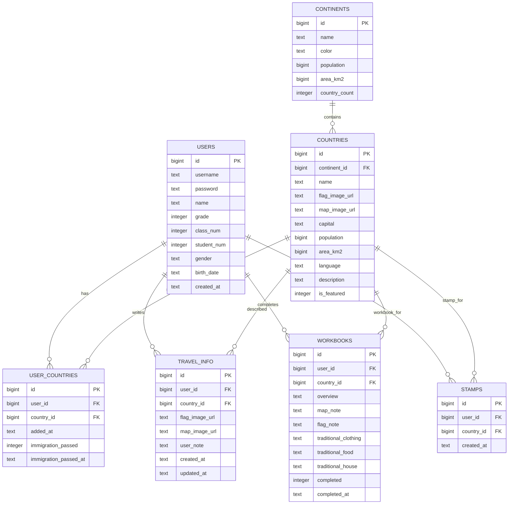
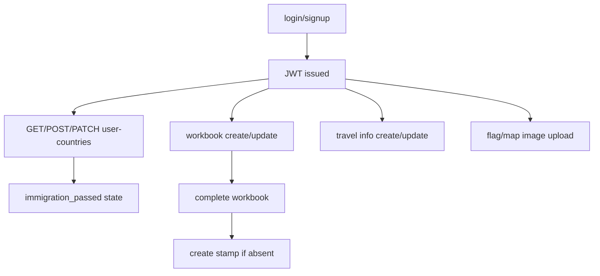

# Backend Analysis Report

이 문서는 `backend` 브랜치의 Spring Boot 백엔드를 `frontend` 브랜치의 Next.js 앱과 안전하게 병합하고 연동하기 위한 기술 분석 보고서이다. 단순 코드 설명보다 "현재 백엔드가 담당하는 기능", "프론트엔드가 호출해야 하는 API", "병합 시 바꿔야 할 지점"을 중심으로 정리한다.

## 1. 프로젝트 개요

- 프로젝트 목적: 학생용 여권형 학습 서비스의 사용자 인증, 방문 국가, 입국 심사 완료, 여행 정보, 학습지, 사증 데이터를 서버에 저장하고 제공한다.
- 백엔드 위치: `backend/`
- 주요 진입점: `backend/src/main/java/com/baeum/BaeumPassportApplication.java`
- 기술 스택: Java 17, Spring Boot, Spring Web, Spring Security, Spring Data JPA, Validation, Lombok, JWT, PostgreSQL
- Spring Boot 버전: `3.2.4` (`backend/build.gradle`)
- Java 버전: `17`
- 데이터베이스: PostgreSQL
- 인증 방식: JWT Bearer token
- 기본 서버 포트: `4000`
- 현재 프론트엔드 원본: 현재 브랜치에는 없음. `frontend` 브랜치에는 Next.js 앱이 `frontend/` 아래에 존재한다.

## 2. 디렉토리 구조 분석

```text
backend/
├── build.gradle
├── settings.gradle
├── gradlew, gradlew.bat
├── gradle/wrapper/
└── src/
    ├── main/java/com/baeum/
    │   ├── config/
    │   ├── controller/
    │   ├── dto/
    │   ├── entity/
    │   ├── exception/
    │   ├── jwt/
    │   ├── repository/
    │   ├── service/
    │   └── util/
    └── main/resources/
        ├── application.properties
        └── schema.sql
```

- `config/`: Spring Security, CORS, 정적 업로드 파일 노출 설정.
- `controller/`: REST API 엔드포인트. `/api/auth`, `/api/user-countries`, `/api/travel-info`, `/api/workbooks`, `/api/stamps`, `/api/upload`.
- `service/`: 인증, 사용자 국가, 여행 정보, 학습지, 스탬프 비즈니스 로직.
- `repository/`: Spring Data JPA Repository. 커스텀 JPQL/Native Query 없이 메서드 이름 기반 쿼리 사용.
- `entity/`: DB 테이블 매핑. 객체 관계 매핑은 사용하지 않고 FK를 `Long` ID 필드로 보관한다.
- `dto/`: Request/Response DTO. JSON 필드는 대부분 snake_case로 내려준다.
- `jwt/`: JWT 생성, 검증, SecurityContext 주입 필터.
- `exception/`: 도메인 예외와 공통 JSON 에러 응답.
- `util/`: 현재 인증 사용자 ID 추출 유틸리티.

## 3. Entity 구조 분석

현재 엔티티는 `@ManyToOne`, `@OneToMany` 같은 JPA 객체 관계를 선언하지 않는다. DB 스키마에는 FK가 있으나 Java Entity에서는 `userId`, `countryId`, `continentId` 같은 scalar FK ID로 관리한다.

| Entity | 파일 | 테이블 | PK | 주요 컬럼 | FK/관계 |
| --- | --- | --- | --- | --- | --- |
| `User` | `backend/src/main/java/com/baeum/entity/User.java` | `users` | `id` | `username`, `password`, `name`, `grade`, `class_num`, `student_num`, `gender`, `birth_date`, `created_at` | `user_countries`, `travel_info`, `workbooks`, `stamps`에서 참조 |
| `Continent` | `backend/src/main/java/com/baeum/entity/Continent.java` | `continents` | `id` | `name`, `color`, `population`, `area_km2`, `country_count` | `countries.continent_id`에서 참조 |
| `Country` | `backend/src/main/java/com/baeum/entity/Country.java` | `countries` | `id` | `name`, `continent_id`, `flag_image_url`, `map_image_url`, `capital`, `population`, `area_km2`, `language`, `description`, `is_featured` | `continent_id -> continents.id` |
| `UserCountry` | `backend/src/main/java/com/baeum/entity/UserCountry.java` | `user_countries` | `id` | `user_id`, `country_id`, `added_at`, `immigration_passed`, `immigration_passed_at` | `user_id -> users.id`, `country_id -> countries.id` |
| `TravelInfo` | `backend/src/main/java/com/baeum/entity/TravelInfo.java` | `travel_info` | `id` | `user_id`, `country_id`, `flag_image_url`, `map_image_url`, `user_note`, `created_at`, `updated_at` | `user_id -> users.id`, `country_id -> countries.id` |
| `Workbook` | `backend/src/main/java/com/baeum/entity/Workbook.java` | `workbooks` | `id` | `user_id`, `country_id`, `overview`, `map_note`, `flag_note`, `traditional_clothing`, `traditional_food`, `traditional_house`, `completed`, `completed_at` | `user_id -> users.id`, `country_id -> countries.id` |
| `Stamp` | `backend/src/main/java/com/baeum/entity/Stamp.java` | `stamps` | `id` | `user_id`, `country_id`, `created_at` | `user_id -> users.id`, `country_id -> countries.id` |

### Entity 관계도



## 4. DTO 구조 분석

| DTO | 유형 | 사용 위치 | 목적 |
| --- | --- | --- | --- |
| `SignupRequestDto` | Request | `POST /api/auth/signup` | 학년/반/번호/성/이름/생년월일/성별 입력. 서버가 `birth_date + last_name + first_name`으로 username 생성 |
| `LoginRequestDto` | Request | `POST /api/auth/login` | username/password 로그인 |
| `AuthResponseDto` | Response | signup/login | `token`, `user_id`, `username`, `name` 반환 |
| `UserInfoDto` | Response | `GET /api/auth/me` | 현재 로그인 사용자 정보 |
| `UserCountryRequestDto` | Request | `POST /api/user-countries` | 방문/추가 국가 등록용 `country_id` |
| `UserCountryResponseDto` | Response | user-country 생성/수정 | 사용자 국가 상태 |
| `UserCountryDto` | Response | `GET /api/user-countries` | 국가명, 국기, 수도, 대륙명, 입국 심사 상태 포함 |
| `TravelInfoRequestDto` | Request | `POST/PATCH /api/travel-info` | 사용자 여행 정보 저장/수정 |
| `TravelInfoDto` | Response | travel-info API | 저장된 여행 정보 |
| `WorkbookUpdateRequest` | Request | `PATCH /api/workbooks/{countryId}` | 학습지 필드 부분 수정 |
| `WorkbookDto` | Response | workbook API | 학습지 상태/내용 |
| `WorkbookCompleteResponse` | Response | `PATCH /api/workbooks/{countryId}/complete` | 완료된 학습지와 스탬프 생성 여부 |
| `StampDto` | Response | stamp API | 획득한 사증/스탬프 표시 정보 |

주의: DTO 메시지 문자열 일부가 인코딩 깨짐 상태이다. API 계약 자체에는 영향이 작지만, 프론트가 에러 메시지를 직접 노출한다면 한글 메시지 복구가 필요하다.

## 5. API 구조 분석

공통 규칙:

- Base URL: `http://localhost:4000`
- 인증 헤더: `Authorization: Bearer <token>`
- 에러 응답: `{"error": "message"}`
- `/api/auth/signup`, `/api/auth/login`만 비인증 허용. 그 외 `/api/**`는 인증 필요.

| Method | URI | 설명 | Request | Response | 인증 여부 |
| --- | --- | --- | --- | --- | --- |
| POST | `/api/auth/signup` | 회원가입. username은 서버에서 생성 | `SignupRequestDto` | `AuthResponseDto` | 불필요 |
| POST | `/api/auth/login` | 로그인 | `LoginRequestDto` | `AuthResponseDto` | 불필요 |
| GET | `/api/auth/me` | 현재 사용자 정보 | 없음 | `UserInfoDto` | 필요 |
| POST | `/api/auth/logout` | 클라이언트 토큰 삭제용 메시지 반환 | 없음 | `{message}` | 필요 |
| GET | `/api/user-countries` | 현재 사용자의 방문/추가 국가 목록 | 없음 | `UserCountryDto[]` | 필요 |
| POST | `/api/user-countries` | 사용자 국가 추가 | `{country_id}` | `UserCountryResponseDto` | 필요 |
| DELETE | `/api/user-countries/{id}` | 사용자 국가 삭제. `{id}`는 user_country id | 없음 | `{message}` | 필요 |
| PATCH | `/api/user-countries/{id}/immigration` | 입국 심사 완료 처리 | 없음 | `UserCountryResponseDto` | 필요 |
| GET | `/api/travel-info/{countryId}` | 사용자별 여행 정보 조회 | 없음 | `TravelInfoDto` | 필요 |
| POST | `/api/travel-info` | 사용자별 여행 정보 생성 | `TravelInfoRequestDto` | `TravelInfoDto` | 필요 |
| PATCH | `/api/travel-info/{countryId}` | 사용자별 여행 정보 부분 수정 | `TravelInfoRequestDto` | `TravelInfoDto` | 필요 |
| POST | `/api/upload/flag` | 국기 이미지 업로드 | multipart `image` | `{url}` | 필요 |
| POST | `/api/upload/map` | 지도 이미지 업로드 | multipart `image` | `{url}` | 필요 |
| GET | `/api/user-countries` | 사증/지도에서 방문 국가 상태 조회에 재사용 | 없음 | `UserCountryDto[]` | 필요 |
| GET | `/api/workbooks/{countryId}` | 사용자별 학습지 조회 | 없음 | `WorkbookDto` | 필요 |
| POST | `/api/workbooks/{countryId}` | 대표 국가 학습지 생성 | 없음 | `WorkbookDto` | 필요 |
| PATCH | `/api/workbooks/{countryId}` | 학습지 수정 | `WorkbookUpdateRequest` | `WorkbookDto` | 필요 |
| PATCH | `/api/workbooks/{countryId}/complete` | 학습지 완료 및 스탬프 자동 생성 | 없음 | `WorkbookCompleteResponse` | 필요 |
| GET | `/api/stamps` | 현재 사용자의 전체 스탬프 조회 | 없음 | `StampDto[]` | 필요 |
| GET | `/api/stamps/{countryId}` | 특정 국가 스탬프 조회 | 없음 | `StampDto` | 필요 |

현재 없는 API:

- `GET /api/continents`
- `GET /api/countries`
- `GET /api/countries/featured`
- `GET /api/countries/{id}` 또는 국가명 기반 조회

이 네 API는 frontend 브랜치의 세계지도, 대표 국가 목록, 국가 상세/학습지 기본값을 서버 데이터로 전환하려면 우선 추가하는 것이 좋다.

## 6. 인증/인가 구조 분석

- JWT 사용 여부: 사용함. `backend/src/main/java/com/baeum/jwt/JwtUtil.java`
- 토큰 생성: `JwtUtil.generateToken(userId, username)`
- 토큰 claim:
  - subject: `username`
  - custom claim: `userId`
  - expiration: `jwt.expiration`, 현재 `86400000` ms
- 토큰 저장 방식: 서버 저장소 없음. 프론트에서 localStorage, memory, cookie 중 하나를 선택해 보관해야 한다.
- 인증 필터: `JwtAuthenticationFilter`
  - `Authorization` 헤더가 `Bearer `로 시작하면 토큰 검증.
  - 성공 시 `SecurityContextHolder` principal에 `Long userId` 저장.
  - username은 authentication details에 저장.
- 사용자 ID 접근: `AuthUtil.getCurrentUserId()`
- SecurityConfig:
  - CSRF disabled
  - CORS enabled
  - session stateless
  - `POST /api/auth/signup`, `POST /api/auth/login` permitAll
  - `/api/**` authenticated
  - form login/basic auth disabled
- 로그인 프로세스:
  1. 프론트가 `POST /api/auth/login`에 `username`, `password` 전송.
  2. 서버가 username 조회 후 BCrypt password 검증.
  3. JWT와 사용자 기본 정보를 반환.
  4. 프론트가 이후 API에 `Authorization: Bearer <token>` 추가.
- 회원가입 프로세스:
  1. 프론트가 학생 정보 전송.
  2. 서버가 `birth_date + last_name + first_name`으로 username 생성.
  3. password는 `birth_date`를 BCrypt encode해 저장.
  4. 가입 직후 JWT 반환.

### API 인증 흐름도


## 7. 데이터베이스 분석

- DB 종류: PostgreSQL
- DB 이름 기본값: `baeum_passport`
- 설정 파일: `backend/src/main/resources/application.properties`
- datasource:
  - `DATABASE_URL` 없으면 `jdbc:postgresql://localhost:5432/baeum_passport`
  - `DATABASE_USERNAME` 없으면 `postgres`
  - `DATABASE_PASSWORD` 없으면 `password`
- JPA 설정:
  - dialect: `org.hibernate.dialect.PostgreSQLDialect`
  - `spring.jpa.hibernate.ddl-auto=update`
  - `spring.jpa.show-sql=true`
- 마이그레이션 도구: Flyway/Liquibase 없음.
- SQL 초기 스키마: `backend/src/main/resources/schema.sql`
- 운영 전환 시 권장:
  - `ddl-auto=validate` 또는 `none`으로 변경
  - Flyway/Liquibase 도입
  - `jwt.secret` 환경변수화
  - 업로드 파일 저장 위치를 배포 환경에 맞게 S3 등으로 분리

## 8. Service 계층 분석

| Service | 파일 | 역할 | 주요 의존성 | 프론트 연동 의미 |
| --- | --- | --- | --- | --- |
| `AuthService` | `backend/src/main/java/com/baeum/service/AuthService.java` | 회원가입, 로그인, 내 정보 조회 | `UserRepository`, `JwtUtil`, `PasswordEncoder` | 로그인/회원가입 화면의 핵심 API |
| `UserCountryService` | `backend/src/main/java/com/baeum/service/UserCountryService.java` | 사용자 방문 국가 추가/삭제, 입국 심사 완료 | `UserCountryRepository`, `CountryRepository`, `ContinentRepository`, `AuthUtil` | 세계지도 사이드탭, 입국 심사 완료 상태 |
| `TravelInfoService` | `backend/src/main/java/com/baeum/service/TravelInfoService.java` | 사용자별 여행 정보 생성/조회/수정 | `TravelInfoRepository`, `CountryRepository`, `AuthUtil` | `/travel-info` localStorage 데이터를 서버로 이전 |
| `WorkbookService` | `backend/src/main/java/com/baeum/service/WorkbookService.java` | 대표 국가 학습지 생성/수정/완료, 완료 시 Stamp 생성 | `WorkbookRepository`, `CountryRepository`, `StampRepository`, `AuthUtil` | `/workbook` localStorage 데이터를 서버로 이전 |
| `StampService` | `backend/src/main/java/com/baeum/service/StampService.java` | 사용자의 스탬프 목록/단건 조회 | `StampRepository`, `CountryRepository`, `ContinentRepository`, `AuthUtil` | `/stamp` 페이지가 서버 상태를 표시 |

### 핵심 호출 흐름



## 9. Repository 분석

| Repository | Entity | 메서드 | 쿼리 방식 |
| --- | --- | --- | --- |
| `UserRepository` | `User` | `findByUsername`, `existsByUsername` | Spring Data derived query |
| `ContinentRepository` | `Continent` | 기본 CRUD | JpaRepository |
| `CountryRepository` | `Country` | `findByContinentId`, `findByIsFeatured` | Spring Data derived query |
| `UserCountryRepository` | `UserCountry` | `findByUserId`, `findByUserIdAndCountryId`, `existsByUserIdAndCountryId` | Spring Data derived query |
| `TravelInfoRepository` | `TravelInfo` | `findByUserIdAndCountryId` | Spring Data derived query |
| `WorkbookRepository` | `Workbook` | `findByUserIdAndCountryId` | Spring Data derived query |
| `StampRepository` | `Stamp` | `findByUserId`, `findByUserIdAndCountryId`, `existsByUserIdAndCountryId` | Spring Data derived query |

- JPQL 사용 여부: 없음.
- Native Query 사용 여부: 없음.
- 현재 구조상 서비스에서 Country/Continent를 반복 조회하므로 목록 API가 커질 경우 N+1 유사 문제가 생길 수 있다. 프론트 연동 초기에는 허용 가능하지만, 국가 수가 늘면 join/projection DTO를 고려한다.

## 10. 설정 파일 분석

| 파일/클래스 | 경로 | 역할 | 병합/배포 시 주의 |
| --- | --- | --- | --- |
| `application.properties` | `backend/src/main/resources/application.properties` | DB, JPA, server port, JWT, multipart, upload dir 설정 | 운영 secret을 파일에 두지 말고 환경변수로 이전 필요 |
| `application.yml` | 없음 | 현재 사용하지 않음 | 추가한다면 properties와 중복 주의 |
| `build.gradle` | `backend/build.gradle` | Spring Boot/JPA/Security/JWT/PostgreSQL/Lombok 의존성 | 모노레포 루트가 아닌 `backend/`에서 실행 |
| `settings.gradle` | `backend/settings.gradle` | Gradle root project name | 현재 유지 가능 |
| `SecurityConfig` | `backend/src/main/java/com/baeum/config/SecurityConfig.java` | 인증/인가, JWT 필터, PasswordEncoder | 모든 `/api/**` 인증 정책이 프론트 초기 조회 API와 충돌할 수 있음 |
| `WebConfig` | `backend/src/main/java/com/baeum/config/WebConfig.java` | CORS `*`, `/uploads/**` 정적 파일 매핑 | 배포 시 `allowedOrigins("*")` 대신 Vercel 도메인 명시 권장 |
| `schema.sql` | `backend/src/main/resources/schema.sql` | 테이블 생성 SQL | 현재 seed data 없음. countries/continents 초기 데이터 필요 |

## 11. 프론트엔드 연동 예상 지점

frontend 브랜치 현황:

- `frontend/src/lib/storage.ts`가 `localStorage`에 `user`, `immigrationCompleted`, `workbookCompleted`, `addedCountries`, `travelInfo`, `workbookNotes`, `workbookRecords`를 저장한다.
- `frontend/src/lib/countries.ts`가 대륙/대표국가 정적 데이터를 보유한다.
- 현재 frontend 브랜치에서는 `fetch`/`axios` 기반 API 호출이 거의 없고, 화면 상태가 로컬에 머문다.

| 프론트 기능 | 현재 프론트 상태 | 백엔드 API | 구현 여부 | 수정 필요 여부 | 연결 방법 |
| --- | --- | --- | --- | --- | --- |
| 로그인 | localStorage user 중심 | `POST /api/auth/login` | 구현됨 | 필요 | 로그인 성공 시 token 저장, 이후 Authorization 헤더 적용 |
| 회원가입 | 학생 정보 입력 UI 예상 | `POST /api/auth/signup` | 구현됨 | 필요 | 가입 성공 시 token 저장 후 `/worldmap` 이동 |
| 내 정보 | localStorage user | `GET /api/auth/me` | 구현됨 | 필요 | 앱 초기 로드 시 token 검증 및 user hydrate |
| 로그아웃 | localStorage 삭제 | `POST /api/auth/logout` | 구현됨 | 선택 | 서버 상태 없음. 프론트에서 token 삭제가 핵심 |
| 세계지도 대륙 정보 | `countries.ts` 정적 데이터 | 없음 | 미구현 | 필요 | `GET /api/continents` 추가 권장 |
| 대표 국가 목록 | `representativeCountries` 정적 데이터 | 없음 | 미구현 | 필요 | `GET /api/countries?featured=true` 또는 `/api/countries/featured` 추가 권장 |
| 방문 국가 목록 | `addedCountries`, `immigrationCompleted` | `GET /api/user-countries` | 구현됨 | 필요 | 문자열 국가명 배열을 서버의 `country_id` 기반 상태로 전환 |
| 국가 추가 | localStorage 배열 추가 | `POST /api/user-countries` | 구현됨 | 필요 | 프론트가 국가명 대신 `country_id`를 알아야 함 |
| 입국 심사 완료 | `immigrationCompleted` 배열 | `PATCH /api/user-countries/{id}/immigration` | 구현됨 | 필요 | `{id}`는 country id가 아니라 user_country id임 |
| 여행 정보 저장 | `travelInfo` 상세 객체 | `POST/PATCH /api/travel-info` | 부분 구현 | 큼 | 현재 백엔드 필드는 `flag/map/user_note` 중심이라 프론트 상세 필드와 불일치 |
| 이미지 업로드 | 프론트 정적/입력 상태 | `POST /api/upload/flag`, `/map` | 구현됨 | 필요 | multipart 업로드 후 반환 URL을 travel-info에 저장 |
| 학습지 저장 | `workbookRecords`, `workbookNotes` | `POST/PATCH /api/workbooks/{countryId}` | 부분 구현 | 큼 | 프론트 상세 학습지 필드와 백엔드 필드 매핑 재정의 필요 |
| 학습지 완료 | `workbookCompleted` 배열 | `PATCH /api/workbooks/{countryId}/complete` | 구현됨 | 필요 | 완료 후 `stamp_created`에 따라 stamp 페이지 갱신 |
| 스탬프 조회 | `workbookCompleted` 기반 표시 | `GET /api/stamps` | 구현됨 | 필요 | 서버 stamps를 기준으로 사증 페이지 렌더링 |

프론트 타입과 백엔드 DTO 간 주요 차이:

- 프론트 `TravelCountryInfo`는 `travelPurpose`, `placesToVisit`, `localPhrase`, `travelTips`, `landmark`, `foodToTry`, `packingList`, `cautions`, `weatherNote`, `freeMemo` 등 상세 필드가 많다.
- 백엔드 `TravelInfo`는 `flagImageUrl`, `mapImageUrl`, `userNote`만 가진다.
- 프론트 `WorkbookRecord`는 `capital`, `language`, `population`, `area`, `greeting`, `researchTopic`, `sources` 등 상세 필드를 가진다.
- 백엔드 `Workbook`은 `overview`, `mapNote`, `flagNote`, `traditionalClothing`, `traditionalFood`, `traditionalHouse` 중심이다.
- 병합 시 프론트 데이터를 백엔드 필드에 축약 저장할지, 백엔드 스키마/DTO를 확장할지 결정해야 한다.

## 12. 병합 시 충돌 예상 영역

| 영역 | 충돌 가능성 | 원인 | 권장 대응 |
| --- | --- | --- | --- |
| `.gitignore` | 높음 | frontend 브랜치와 backend 브랜치 모두 루트 ignore를 수정 | `frontend/.next`, `frontend/node_modules`, `backend/build`, `backend/.gradle`, 업로드/로그 규칙을 모두 보존 |
| `README.md` | 높음 | backend 브랜치의 모노레포 README와 frontend 브랜치의 프로젝트 README가 다름 | 루트 README는 실행/구조 중심, 상세 기획은 docs로 분리 |
| `docs/` | 중간 | 양 브랜치가 분석/복구 문서를 추가 | 문서명을 유지하고 중복 내용은 통합 |
| `frontend/.gitkeep` | 낮음 | frontend 브랜치 병합 시 실제 파일이 들어옴 | 병합 후 `.gitkeep` 삭제 가능 |
| API URL 설정 | 중간 | frontend에는 API client/env가 아직 없음 | `NEXT_PUBLIC_API_BASE_URL=http://localhost:4000` 도입 권장 |
| localStorage 상태 | 높음 | frontend가 서버 상태 대신 localStorage를 사용 | 인증 토큰 외의 도메인 상태는 API로 전환 |
| 국가 식별자 | 높음 | frontend는 한국어 국가명 string 중심, backend는 `country_id` 중심 | 국가 조회 API를 추가하고 name-id 매핑 레이어 구성 |
| CORS/배포 | 중간 | 백엔드 CORS가 `*`, 프론트는 Vercel 예상 | 개발 중 OK, 운영 전 도메인 제한 |
| 업로드 파일 | 중간 | 백엔드 로컬 `uploads/`, 배포 환경은 ephemeral storage 가능 | AWS S3/Cloud storage 검토 |

## 13. 병합 전략 제안

1. 구조 병합
   - 현재 backend 브랜치의 `backend/`, `docs/`, 루트 README/.gitignore를 기준으로 유지.
   - frontend 브랜치의 `frontend/` 전체를 가져오고 `frontend/.gitkeep`은 제거.
   - `.gitignore`, `README.md`, `docs/` 충돌을 먼저 해결.

2. API client 도입
   - `frontend/src/lib/api.ts` 같은 단일 client 생성.
   - `NEXT_PUBLIC_API_BASE_URL`를 사용하고 기본값은 `http://localhost:4000`.
   - token 저장/조회와 Authorization 헤더 주입을 한 곳에 모은다.

3. 인증부터 연결
   - `/login` -> `POST /api/auth/login`
   - `/signup` -> `POST /api/auth/signup`
   - 앱 초기화 -> `GET /api/auth/me`
   - 인증 실패 시 token 삭제 후 login으로 이동.

4. 국가 기준 데이터 정리
   - 백엔드에 `ContinentController`, `CountryController` 추가를 먼저 수행하는 것이 안전하다.
   - 프론트의 `countries.ts`는 즉시 삭제하지 말고 fallback/seed 기준으로 유지한다.
   - DB seed가 없다면 `continents`, `countries` 초기 데이터 삽입 전략을 추가한다.

5. localStorage API 전환 순서
   - `user` -> auth/me
   - `addedCountries`, `immigrationCompleted` -> `/api/user-countries`
   - `workbookCompleted` -> `/api/stamps` 및 `/api/workbooks`
   - `travelInfo` -> `/api/travel-info`
   - `workbookRecords` -> `/api/workbooks`

6. 필드 불일치 해결
   - 단기: 프론트 상세 필드를 하나의 JSON 문자열로 `user_note` 또는 workbook note 필드에 저장하지 않는 편이 좋다. 검색/수정/검증이 어려워진다.
   - 권장: `TravelInfo`와 `Workbook`의 컬럼/DTO를 프론트 실제 입력 필드에 맞게 확장하거나, 프론트 입력 폼을 백엔드 DTO에 맞게 축소한다.

7. 테스트 순서
   - Backend: `cd backend && .\gradlew.bat build`
   - Frontend: `cd frontend && npm install && npm run lint && npm run build`
   - 통합 수동 테스트: signup -> login -> me -> user-countries -> immigration -> workbook create/update/complete -> stamps -> travel-info -> upload
   - 브라우저 Network 탭에서 모든 인증 API에 Bearer token이 붙는지 확인.

8. 예상 작업량
   - 단순 구조 병합: 낮음.
   - 인증 API 연결: 중간.
   - localStorage 전체 API 전환: 중간~높음.
   - 국가/대륙 조회 API와 seed 데이터 추가: 중간.
   - TravelInfo/Workbook 필드 확장까지 포함하면 높음.

## 14. 최종 요약

- 현재 백엔드 완성도: 인증, 사용자 국가, 입국 심사, 여행 정보 기본 저장, 학습지, 스탬프, 이미지 업로드의 핵심 API는 구현되어 있다.
- 프론트 연동 준비 상태: 인증 기반 API는 바로 연결 가능하지만, 세계지도/대표국가 조회 API와 프론트 상세 입력 필드 대응이 부족하다.
- 병합 난이도: 구조 병합은 보통, 기능 연동은 중간 이상.
- 가장 위험한 충돌 지점: `.gitignore`, `README.md`, localStorage 기반 프론트 상태와 서버 API의 데이터 모델 차이, 국가명 string과 `country_id` 식별자 차이.
- 추천 병합 전략: 먼저 모노레포 구조를 안정화하고 인증 API를 붙인 뒤, 국가/대륙 조회 API를 추가한다. 그 다음 localStorage 상태를 기능별로 하나씩 서버 API로 전환한다. TravelInfo와 Workbook은 필드 계약을 먼저 확정한 후 백엔드 DTO/DB 또는 프론트 폼 중 한쪽을 맞춰야 한다.

## Codex 작업용 체크리스트

- [ ] frontend 브랜치 병합 후 `frontend/.gitkeep` 삭제.
- [ ] `frontend/src/lib/api.ts` 생성 및 `NEXT_PUBLIC_API_BASE_URL` 적용.
- [ ] login/signup/me API 연결.
- [ ] `GET /api/continents`, `GET /api/countries`, `GET /api/countries/featured` 추가 여부 결정 및 구현.
- [ ] `countries.ts` 정적 데이터와 DB seed 데이터 싱크.
- [ ] `TravelInfoRequestDto`, `TravelInfo` 필드 확장 여부 결정.
- [ ] `WorkbookUpdateRequest`, `Workbook` 필드 확장 여부 결정.
- [ ] CORS allowed origins를 개발/운영 환경별로 분리.
- [ ] JWT secret을 환경변수로 이전.
- [ ] backend/frontend 각각 build/lint/test 실행.
