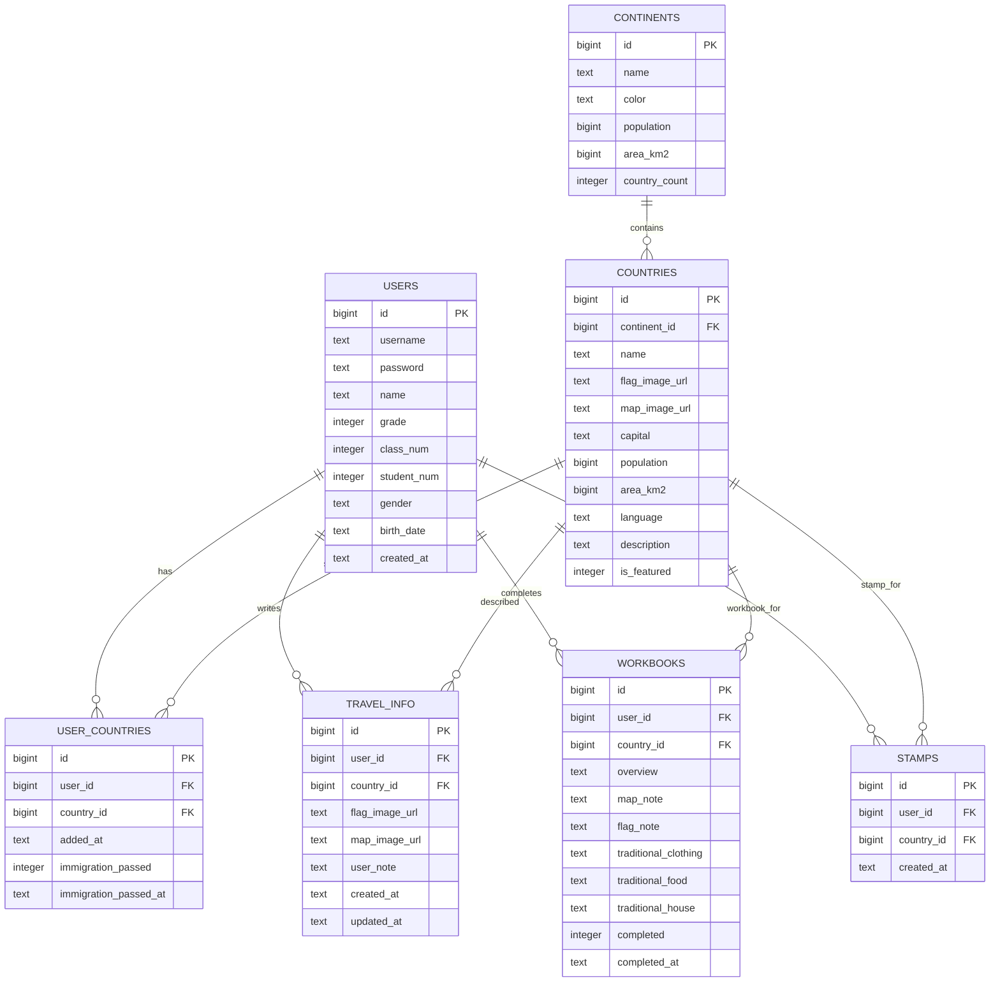
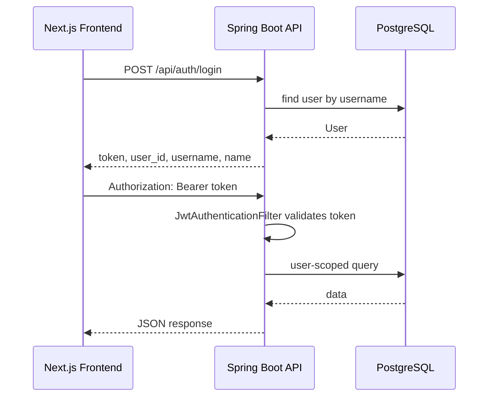
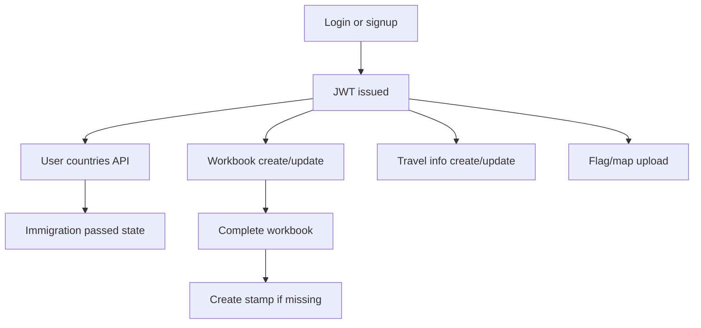

# Backend Analysis Report

This document analyzes the Spring Boot backend on the `backend` side of the monorepo for a future merge with the `frontend` branch. It is written as an integration guide: what the backend owns, which APIs the frontend should call, where the current frontend state model differs from the backend model, and what should be handled during the merge.

Encoding check: the previous Korean version was valid UTF-8 and did not contain replacement characters. This English version avoids Korean rendering issues in terminals, Git tools, and Markdown previewers that are not configured for UTF-8.

## 1. Project Overview

- Purpose: provide server-side authentication and persistence for the Baeum Passport learning app, including users, visited countries, immigration completion, travel information, workbooks, stamps, and image uploads.
- Backend path: `backend/`
- Main entry point: `backend/src/main/java/com/baeum/BaeumPassportApplication.java`
- Stack: Java 17, Spring Boot, Spring Web, Spring Security, Spring Data JPA, Bean Validation, Lombok, JWT, PostgreSQL
- Spring Boot version: `3.2.4` in `backend/build.gradle`
- Java version: `17`
- Database: PostgreSQL
- Authentication: stateless JWT Bearer token
- Default backend port: `4000`
- Current frontend source: merged under `frontend/` from the `frontend` branch.

## 2. Directory Structure

```text
backend/
├── build.gradle
├── settings.gradle
├── gradlew
├── gradlew.bat
├── gradle/wrapper/
└── src/
    ├── main/java/com/baeum/
    │   ├── config/
    │   ├── controller/
    │   ├── dto/
    │   ├── entity/
    │   ├── exception/
    │   ├── jwt/
    │   ├── repository/
    │   ├── service/
    │   └── util/
    └── main/resources/
        ├── application.properties
        └── schema.sql
```

- `config/`: Spring Security, CORS, password encoder, and static upload file mapping.
- `controller/`: REST API endpoints under `/api`.
- `service/`: business logic for auth, user countries, travel info, workbooks, stamps, and uploads.
- `repository/`: Spring Data JPA repositories using derived query methods.
- `entity/`: JPA entities mapped to PostgreSQL tables.
- `dto/`: request and response DTOs. JSON field names mostly use snake_case through `@JsonProperty`.
- `jwt/`: JWT creation, validation, and request authentication filter.
- `exception/`: custom exceptions and shared JSON error handling.
- `util/`: helper for reading the current authenticated user id from Spring Security.

## 3. Entity Model

The backend schema has foreign keys in SQL, but the Java entities do not use object relationships such as `@ManyToOne` or `@OneToMany`. They store foreign keys as scalar `Long` fields such as `userId`, `countryId`, and `continentId`.

| Entity | File | Table | Primary Key | Main Columns | Relationships |
| --- | --- | --- | --- | --- | --- |
| `User` | `backend/src/main/java/com/baeum/entity/User.java` | `users` | `id` | `username`, `password`, `name`, `grade`, `class_num`, `student_num`, `gender`, `birth_date`, `created_at` | Referenced by user-owned tables |
| `Continent` | `backend/src/main/java/com/baeum/entity/Continent.java` | `continents` | `id` | `name`, `color`, `population`, `area_km2`, `country_count` | One continent has many countries |
| `Country` | `backend/src/main/java/com/baeum/entity/Country.java` | `countries` | `id` | `name`, `continent_id`, `flag_image_url`, `map_image_url`, `capital`, `population`, `area_km2`, `language`, `description`, `is_featured` | Belongs to a continent, referenced by user data |
| `UserCountry` | `backend/src/main/java/com/baeum/entity/UserCountry.java` | `user_countries` | `id` | `user_id`, `country_id`, `added_at`, `immigration_passed`, `immigration_passed_at` | Connects a user to a country |
| `TravelInfo` | `backend/src/main/java/com/baeum/entity/TravelInfo.java` | `travel_info` | `id` | `user_id`, `country_id`, `flag_image_url`, `map_image_url`, `user_note`, `created_at`, `updated_at` | User-owned travel note for a country |
| `Workbook` | `backend/src/main/java/com/baeum/entity/Workbook.java` | `workbooks` | `id` | `user_id`, `country_id`, `overview`, `map_note`, `flag_note`, `traditional_clothing`, `traditional_food`, `traditional_house`, `completed`, `completed_at` | User-owned workbook for a country |
| `Stamp` | `backend/src/main/java/com/baeum/entity/Stamp.java` | `stamps` | `id` | `user_id`, `country_id`, `created_at` | Created when a workbook is completed |

### Entity Relationship Diagram



## 4. DTO Model

| DTO | Type | Used By | Purpose |
| --- | --- | --- | --- |
| `SignupRequestDto` | Request | `POST /api/auth/signup` | Student signup fields. The backend creates `username` from `birth_date + last_name + first_name`. |
| `LoginRequestDto` | Request | `POST /api/auth/login` | Username/password login. |
| `AuthResponseDto` | Response | signup/login | Returns `token`, `user_id`, `username`, and `name`. |
| `UserInfoDto` | Response | `GET /api/auth/me` | Current authenticated user profile. |
| `UserCountryRequestDto` | Request | `POST /api/user-countries` | Adds a country to the current user by `country_id`. |
| `UserCountryResponseDto` | Response | user-country mutations | Returns country status for the current user. |
| `UserCountryDto` | Response | `GET /api/user-countries` | Includes country name, flag, capital, continent name, and immigration status. |
| `TravelInfoRequestDto` | Request | `POST/PATCH /api/travel-info` | Stores or updates user travel information. |
| `TravelInfoDto` | Response | travel-info API | Returns stored travel information. |
| `WorkbookUpdateRequest` | Request | `PATCH /api/workbooks/{countryId}` | Partially updates workbook fields. |
| `WorkbookDto` | Response | workbook API | Returns workbook content and completion state. |
| `WorkbookCompleteResponse` | Response | workbook completion | Returns the completed workbook and whether a stamp was created. |
| `StampDto` | Response | stamp API | Data needed by the stamp/passport page. |

Note: several validation/error messages in the source files appear to be mojibake. The JSON contract still works, but user-facing error messages should be restored before production.

## 5. API Structure

Common rules:

- Base URL in local development: `http://localhost:4000`
- Auth header: `Authorization: Bearer <token>`
- Error response shape: `{"error": "message"}`
- Only `POST /api/auth/signup` and `POST /api/auth/login` are public. Other `/api/**` routes require authentication.

| Method | URI | Description | Request | Response | Auth |
| --- | --- | --- | --- | --- | --- |
| POST | `/api/auth/signup` | Register user and issue token | `SignupRequestDto` | `AuthResponseDto` | No |
| POST | `/api/auth/login` | Login and issue token | `LoginRequestDto` | `AuthResponseDto` | No |
| GET | `/api/auth/me` | Current user profile | none | `UserInfoDto` | Yes |
| POST | `/api/auth/logout` | Stateless logout message | none | `{message}` | Yes |
| GET | `/api/user-countries` | Current user's countries | none | `UserCountryDto[]` | Yes |
| POST | `/api/user-countries` | Add user country | `{country_id}` | `UserCountryResponseDto` | Yes |
| DELETE | `/api/user-countries/{id}` | Delete user country by user-country id | none | `{message}` | Yes |
| PATCH | `/api/user-countries/{id}/immigration` | Mark immigration as passed | none | `UserCountryResponseDto` | Yes |
| GET | `/api/travel-info/{countryId}` | Get travel info for a country | none | `TravelInfoDto` | Yes |
| POST | `/api/travel-info` | Create travel info | `TravelInfoRequestDto` | `TravelInfoDto` | Yes |
| PATCH | `/api/travel-info/{countryId}` | Update travel info | `TravelInfoRequestDto` | `TravelInfoDto` | Yes |
| POST | `/api/upload/flag` | Upload flag image | multipart `image` | `{url}` | Yes |
| POST | `/api/upload/map` | Upload map image | multipart `image` | `{url}` | Yes |
| GET | `/api/workbooks/{countryId}` | Get workbook | none | `WorkbookDto` | Yes |
| POST | `/api/workbooks/{countryId}` | Create workbook for featured country | none | `WorkbookDto` | Yes |
| PATCH | `/api/workbooks/{countryId}` | Update workbook | `WorkbookUpdateRequest` | `WorkbookDto` | Yes |
| PATCH | `/api/workbooks/{countryId}/complete` | Complete workbook and create stamp if needed | none | `WorkbookCompleteResponse` | Yes |
| GET | `/api/stamps` | Get all current user stamps | none | `StampDto[]` | Yes |
| GET | `/api/stamps/{countryId}` | Get one stamp by country id | none | `StampDto` | Yes |

Currently missing APIs that the frontend will probably need:

- `GET /api/continents`
- `GET /api/countries`
- `GET /api/countries/featured`
- `GET /api/countries/{id}` or a country-name lookup

These APIs should be added before fully replacing the frontend's static country dataset with backend data.

## 6. Authentication and Authorization

- JWT support: implemented in `backend/src/main/java/com/baeum/jwt/JwtUtil.java`
- Token generation: `JwtUtil.generateToken(userId, username)`
- Token claims:
  - subject: `username`
  - custom claim: `userId`
  - expiration: `jwt.expiration`, currently `86400000` ms
- Server-side token storage: none
- Frontend token storage: not implemented yet. The frontend should store the token and attach it to authenticated requests.
- Auth filter: `JwtAuthenticationFilter`
  - Reads `Authorization: Bearer <token>`
  - Validates the token
  - Stores the authenticated user id as the Spring Security principal
- Current user helper: `AuthUtil.getCurrentUserId()`
- Security policy:
  - CSRF disabled
  - CORS enabled
  - stateless session
  - signup/login are public
  - all `/api/**` routes are authenticated otherwise

### Authentication Flow



## 7. Database Analysis

- Database: PostgreSQL
- Default database name: `baeum_passport`
- Config file: `backend/src/main/resources/application.properties`
- Datasource defaults:
  - `DATABASE_URL`, fallback `jdbc:postgresql://localhost:5432/baeum_passport`
  - `DATABASE_USERNAME`, fallback `postgres`
  - `DATABASE_PASSWORD`, fallback `password`
- JPA:
  - dialect: `org.hibernate.dialect.PostgreSQLDialect`
  - `spring.jpa.hibernate.ddl-auto=update`
  - `spring.jpa.show-sql=true`
- Migration tool: none. No Flyway or Liquibase.
- Schema file: `backend/src/main/resources/schema.sql`

Deployment recommendations:

- Move `jwt.secret` to an environment variable.
- Use `ddl-auto=validate` or `none` outside local development.
- Add Flyway or Liquibase for predictable schema migrations.
- Add seed data for `continents` and `countries`.
- Avoid local filesystem uploads in production; use object storage if deploying to Render/AWS-like environments.

## 8. Service Layer

| Service | File | Responsibility | Dependencies | Frontend Meaning |
| --- | --- | --- | --- | --- |
| `AuthService` | `backend/src/main/java/com/baeum/service/AuthService.java` | signup, login, current user profile | `UserRepository`, `JwtUtil`, `PasswordEncoder` | Login/signup pages |
| `UserCountryService` | `backend/src/main/java/com/baeum/service/UserCountryService.java` | add/delete user countries, immigration status | `UserCountryRepository`, `CountryRepository`, `ContinentRepository`, `AuthUtil` | World map sidebar and immigration completion |
| `TravelInfoService` | `backend/src/main/java/com/baeum/service/TravelInfoService.java` | create/read/update user travel info | `TravelInfoRepository`, `CountryRepository`, `AuthUtil` | Replace `/travel-info` localStorage state |
| `WorkbookService` | `backend/src/main/java/com/baeum/service/WorkbookService.java` | create/update/complete workbooks and create stamps | `WorkbookRepository`, `CountryRepository`, `StampRepository`, `AuthUtil` | Replace workbook localStorage state |
| `StampService` | `backend/src/main/java/com/baeum/service/StampService.java` | read current user stamps | `StampRepository`, `CountryRepository`, `ContinentRepository`, `AuthUtil` | Passport stamp page |

### Backend Domain Flow



## 9. Repository Layer

| Repository | Entity | Methods | Query Type |
| --- | --- | --- | --- |
| `UserRepository` | `User` | `findByUsername`, `existsByUsername` | Spring Data derived query |
| `ContinentRepository` | `Continent` | default CRUD | `JpaRepository` |
| `CountryRepository` | `Country` | `findByContinentId`, `findByIsFeatured` | Spring Data derived query |
| `UserCountryRepository` | `UserCountry` | `findByUserId`, `findByUserIdAndCountryId`, `existsByUserIdAndCountryId` | Spring Data derived query |
| `TravelInfoRepository` | `TravelInfo` | `findByUserIdAndCountryId` | Spring Data derived query |
| `WorkbookRepository` | `Workbook` | `findByUserIdAndCountryId` | Spring Data derived query |
| `StampRepository` | `Stamp` | `findByUserId`, `findByUserIdAndCountryId`, `existsByUserIdAndCountryId` | Spring Data derived query |

- JPQL: none.
- Native SQL queries: none.
- Potential future issue: service methods repeatedly fetch `Country` and `Continent` while mapping lists. This is acceptable for the current small dataset, but projections or joins would be better if the data grows.

## 10. Configuration Files

| File/Class | Path | Role | Merge/Deployment Notes |
| --- | --- | --- | --- |
| `application.properties` | `backend/src/main/resources/application.properties` | DB, JPA, port, JWT, multipart, upload dir | Move secrets to environment variables |
| `application.yml` | none | Not used | Avoid duplicate config if added later |
| `build.gradle` | `backend/build.gradle` | Dependencies and Spring Boot plugin | Run Gradle from `backend/` |
| `settings.gradle` | `backend/settings.gradle` | Gradle root project name | Can stay as-is |
| `SecurityConfig` | `backend/src/main/java/com/baeum/config/SecurityConfig.java` | Auth policy, JWT filter, password encoder | Public country APIs may need permitAll |
| `WebConfig` | `backend/src/main/java/com/baeum/config/WebConfig.java` | CORS and `/uploads/**` file serving | Replace wildcard CORS with explicit origins for production |
| `schema.sql` | `backend/src/main/resources/schema.sql` | Initial table definitions | Add migrations and seed data later |

## 11. Frontend Integration Points

Current frontend branch facts:

- `frontend/src/lib/storage.ts` stores app state in localStorage.
- `frontend/src/lib/countries.ts` stores static continent and representative country data.
- The frontend does not yet have a shared API client for the backend.

| Frontend Feature | Current Frontend State | Backend API | Backend Status | Required Work | Integration Method |
| --- | --- | --- | --- | --- | --- |
| Login | local user state | `POST /api/auth/login` | Implemented | Required | Store token and user, attach Bearer token |
| Signup | student form UI | `POST /api/auth/signup` | Implemented | Required | Store token after signup |
| Current user | localStorage user | `GET /api/auth/me` | Implemented | Required | Hydrate app session from token |
| Logout | clear local state | `POST /api/auth/logout` | Implemented | Optional | Clear token on frontend; backend is stateless |
| World map continents | static `countries.ts` | missing | Not implemented | Required | Add `GET /api/continents` |
| Featured countries | static `representativeCountries` | missing | Not implemented | Required | Add `GET /api/countries/featured` |
| User countries | `addedCountries`, `immigrationCompleted` | `GET /api/user-countries` | Implemented | Required | Replace country-name arrays with server state |
| Add country | localStorage array | `POST /api/user-countries` | Implemented | Required | Frontend needs `country_id` |
| Immigration pass | localStorage array | `PATCH /api/user-countries/{id}/immigration` | Implemented | Required | Use user-country id, not country id |
| Travel info | `travelInfo` object | `POST/PATCH /api/travel-info` | Partially compatible | Significant | Align frontend fields with backend DTO |
| Image upload | static/input state | `POST /api/upload/flag`, `/map` | Implemented | Required | Upload multipart image and save returned URL |
| Workbook | `workbookRecords`, `workbookNotes` | `POST/PATCH /api/workbooks/{countryId}` | Partially compatible | Significant | Align workbook fields |
| Workbook complete | `workbookCompleted` array | `PATCH /api/workbooks/{countryId}/complete` | Implemented | Required | Refresh stamps after completion |
| Stamps | derived from workbook completion | `GET /api/stamps` | Implemented | Required | Render from server stamps |

Major frontend/backend model gaps:

- Frontend `TravelCountryInfo` has many fields: travel purpose, places to visit, phrase, tips, landmark, food, packing list, cautions, weather, memo.
- Backend `TravelInfo` currently has only `flagImageUrl`, `mapImageUrl`, and `userNote`.
- Frontend `WorkbookRecord` has many educational fields: capital, language, population, area, greeting, research topic, sources, comparisons.
- Backend `Workbook` has a smaller set: overview, map note, flag note, traditional clothing, food, and house.
- The merge should decide whether to expand backend schema/DTOs or simplify the frontend forms.

## 12. Expected Merge Conflict Areas

| Area | Risk | Cause | Recommendation |
| --- | --- | --- | --- |
| `.gitignore` | High | Both branches edit ignore rules | Keep frontend and backend build/cache rules |
| `README.md` | High | Monorepo README and frontend project README differ | Keep root README focused on structure and run commands |
| `docs/` | Medium | Both branches add planning documents | Keep distinct filenames and merge duplicated guidance |
| API base URL | Medium | Frontend does not yet define backend client/env | Add `NEXT_PUBLIC_API_BASE_URL` |
| localStorage state | High | Frontend stores domain state locally | Gradually replace with API calls |
| Country identifiers | High | Frontend uses Korean country names, backend uses numeric ids | Add country API and name-to-id mapping |
| CORS/deployment | Medium | Backend allows all origins | Restrict origins for production |
| Upload storage | Medium | Backend uses local `uploads/` | Use object storage for cloud deployments |

## 13. Suggested Merge Strategy

1. Stabilize structure
   - Keep `backend/`, `frontend/`, `docs/`, root `README.md`, and root `.gitignore`.
   - Ensure `backend/build/`, `backend/.gradle/`, `frontend/.next/`, and `frontend/node_modules/` stay ignored.

2. Add frontend API client
   - Create a single API helper such as `frontend/src/lib/api.ts`.
   - Use `NEXT_PUBLIC_API_BASE_URL`, defaulting to `http://localhost:4000`.
   - Centralize token storage and Authorization header injection.

3. Connect auth first
   - `/login` -> `POST /api/auth/login`
   - `/signup` -> `POST /api/auth/signup`
   - App/session bootstrap -> `GET /api/auth/me`

4. Add country/continent read APIs
   - Implement continent and country controllers before replacing `countries.ts`.
   - Seed the DB with continent/country data that matches the current frontend dataset.

5. Replace localStorage by feature
   - Auth user -> `/api/auth/me`
   - Added countries and immigration -> `/api/user-countries`
   - Workbook completion and stamps -> `/api/workbooks`, `/api/stamps`
   - Travel info -> `/api/travel-info`
   - Workbook records -> `/api/workbooks`

6. Resolve field mismatches
   - Preferred: expand backend DTOs and schema to match frontend forms.
   - Alternative: reduce frontend form fields to match current backend fields.
   - Avoid storing large structured frontend objects as one JSON string unless this is explicitly chosen as a short-term compromise.

## 14. Final Summary

- Backend maturity: core authenticated APIs exist for users, user countries, immigration state, basic travel info, workbooks, stamps, and uploads.
- Frontend readiness: the frontend can run locally, but most domain state still uses localStorage and static data.
- Merge difficulty: structure merge is moderate; full functional integration is medium to high.
- Highest-risk points: `.gitignore`, root README, country id/name mismatch, and TravelInfo/Workbook field mismatch.
- Recommended approach: keep the monorepo structure stable, connect authentication first, add country/continent APIs, then replace localStorage feature by feature.

## Codex Implementation Checklist

- [ ] Confirm both apps run locally: backend on `localhost:4000`, frontend on `localhost:3000`.
- [ ] Add `frontend/src/lib/api.ts` and `NEXT_PUBLIC_API_BASE_URL`.
- [ ] Connect login/signup/me to backend auth APIs.
- [ ] Add country and continent read APIs in the backend.
- [ ] Seed or migrate `continents` and `countries`.
- [ ] Replace frontend localStorage state with API calls incrementally.
- [ ] Decide whether to expand `TravelInfo` and `Workbook` schemas.
- [ ] Move JWT secret to environment variables.
- [ ] Restrict CORS origins for deployed environments.
- [ ] Run backend build and frontend lint/build after integration.
